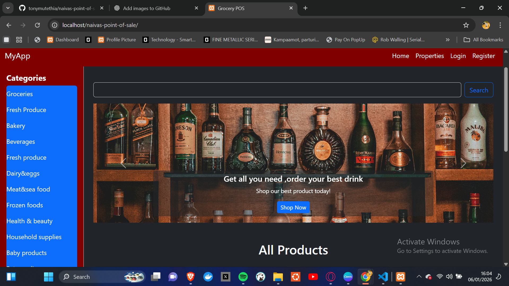
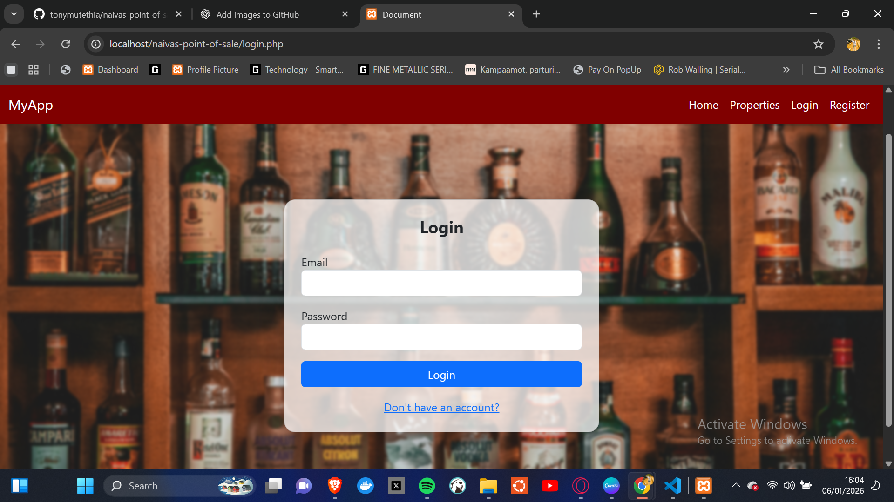
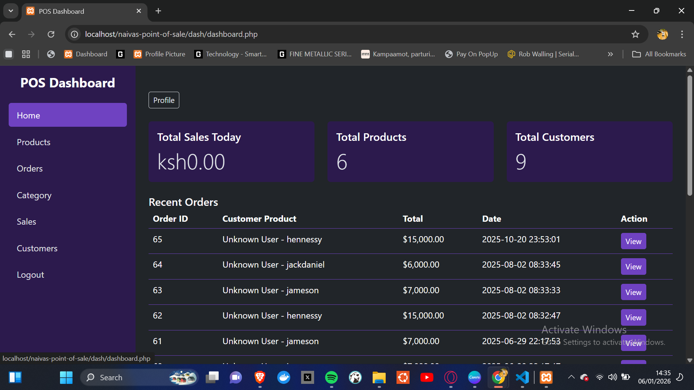
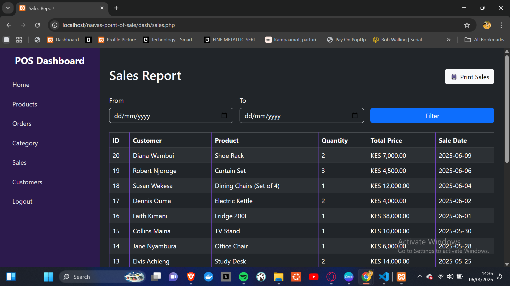

# Naivas Point of Sale

This is a **student project**: a Point of Sale (POS) system designed for Naivas supermarket operations.  
It demonstrates core POS functionalities and provides a simple interface for managing products, sales, and reports.

---

## Features

- **User Authentication:** Secure login for users.
- **Product Management:** Add, edit, and delete products.
- **Sales Tracking:** Record and view sales transactions.
- **Reports:** Generate sales summaries for analysis.
- **User-Friendly Interface:** Easy navigation and interaction.

---

## Screenshots
**welcome**



**Login Page**  


**Dashboard**  


**Sales Page**  


**Reports**  


---

## Technologies Used

- PHP
- MySQL
- HTML, CSS, Bootstrap
- JavaScript

---

## How to Run Locally

1. Clone the repository:  
```bash
git clone https://github.com/tonymutethia/naivas-point-of-sale.git
